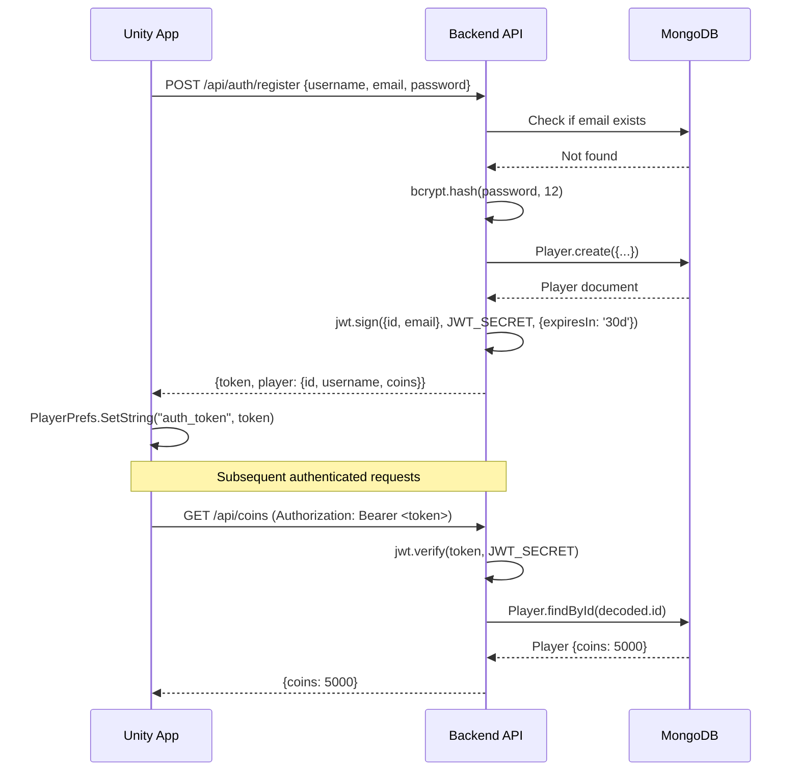
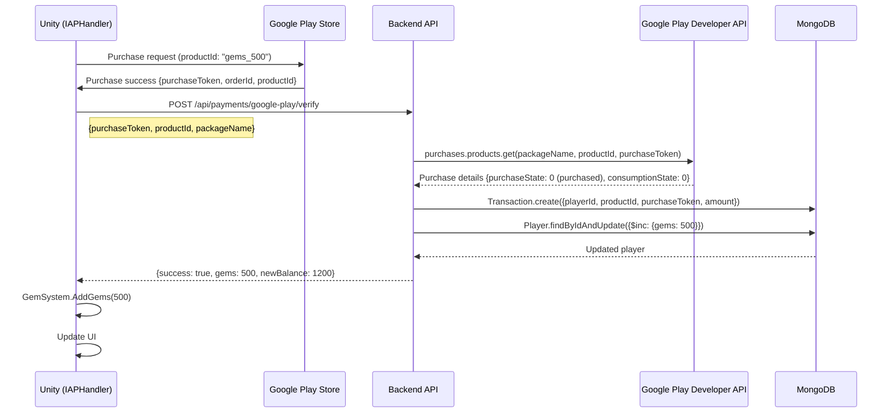
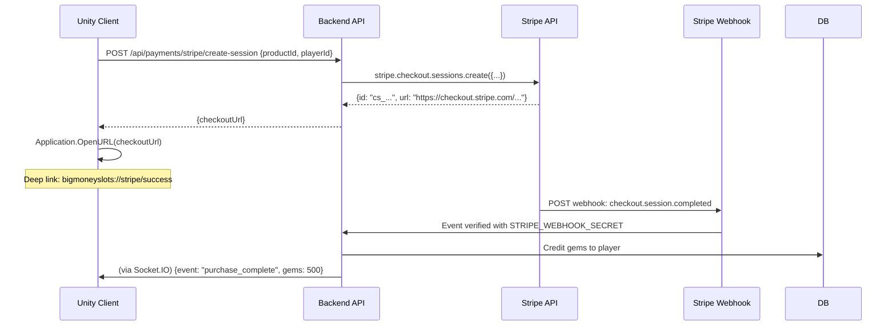
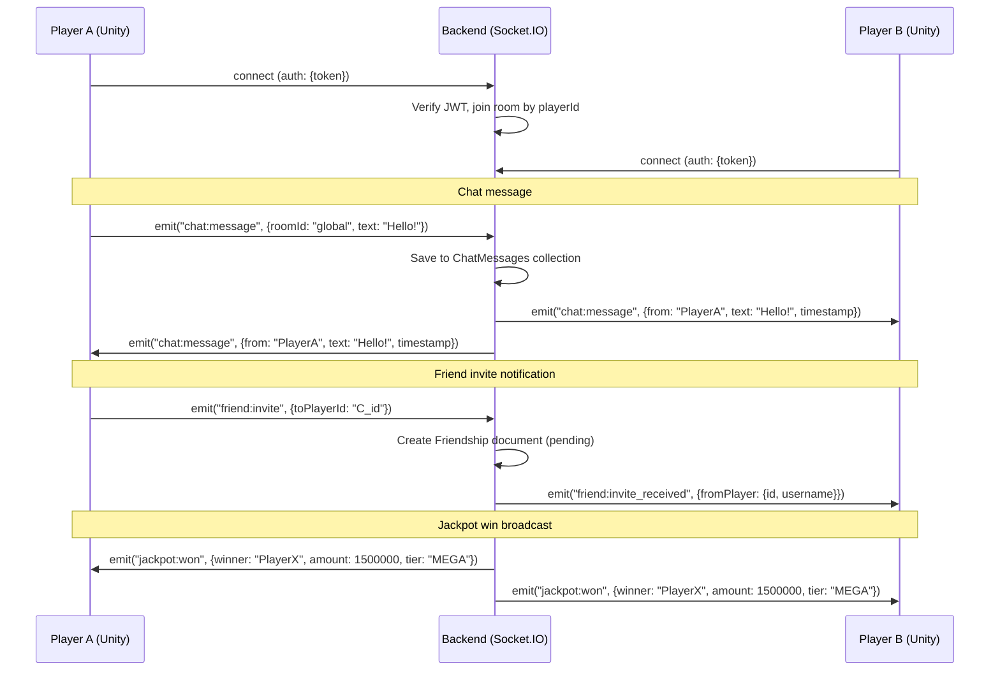

# 🎰 Big Money Slots — Complete Build & Deployment Guide

> **Version:** 1.0 &nbsp;|&nbsp; **Updated:** 2026-03 &nbsp;|&nbsp; **Engine:** Unity 2022.3 LTS &nbsp;|&nbsp; **Platform:** Android (Google Play)

This is the authoritative, end-to-end reference for building **Big Money Slots** in Unity and publishing it to the Google Play Store. A junior developer who has never used Unity or Google Play Console should be able to follow this guide from zero to a live app.

---

## 📑 Table of Contents

1. [📋 Prerequisites & System Requirements](#1--prerequisites--system-requirements)
2. [🎮 Unity Project Setup](#2--unity-project-setup)
3. [⚙️ Unity Build Settings Configuration](#3-️-unity-build-settings-configuration)
4. [🔧 Backend Server Setup & Configuration](#4--backend-server-setup--configuration)
5. [🔗 Connecting Unity Client to Backend](#5--connecting-unity-client-to-backend)
6. [📱 Building the Android APK/AAB](#6--building-the-android-apkaab)
7. [🏪 Google Play Console — Creating the App Listing](#7--google-play-console--creating-the-app-listing)
8. [📤 Google Play Console — Uploading the AAB](#8--google-play-console--uploading-the-aab)
9. [💰 Setting Up In-App Purchases in Google Play Console](#9--setting-up-in-app-purchases-in-google-play-console)
10. [🔒 Setting Up Payment Providers](#10--setting-up-payment-providers)
11. [🚀 Production Deployment Checklist](#11--production-deployment-checklist)
12. [🐛 Troubleshooting & Common Issues](#12--troubleshooting--common-issues)
13. [📊 Architecture Diagrams](#13--architecture-diagrams)

---

## 1. 📋 Prerequisites & System Requirements

### 1.1 Unity

| Requirement | Value |
|---|---|
| Unity version | **2022.3 LTS** (Long-Term Support) — any 2022.3.x patch |
| Unity Hub | 3.x or later |
| Build Support module | **Android Build Support** (install via Unity Hub) |

> **💡 TIP:** Always use an LTS release for production projects. Go to [unity.com/releases/lts](https://unity.com/releases/lts) and download the latest 2022.3.x installer via Unity Hub.

Install Unity Hub, then use **Installs → Add → Archive** to select Unity 2022.3 LTS. During installation, check the following add-on modules:

```
☑ Android Build Support
  ☑ Android SDK & NDK Tools  (bundled)
  ☑ OpenJDK                  (bundled)
```

<!-- Screenshot: Unity Hub "Add Unity Version" dialog showing 2022.3 LTS selected with Android Build Support, Android SDK & NDK Tools, and OpenJDK modules checked -->

### 1.2 Android SDK, NDK & JDK

Unity 2022.3 bundles all three. If you need standalone versions:

| Tool | Minimum version |
|---|---|
| Android SDK (compileSdkVersion) | API 34 (Android 14) |
| Android NDK | r23c or r25b |
| JDK (OpenJDK) | 11 (LTS) |

> **💡 TIP:** In Unity, navigate to **Edit → Preferences → External Tools** and confirm Unity is pointing at its own bundled SDK/NDK/JDK paths. Using external installations can cause Gradle build failures.

<!-- Screenshot: Unity Preferences window, "External Tools" section — Android SDK Root, NDK Root, and JDK fields all pointing to Unity's bundled paths (e.g., C:\Program Files\Unity\Hub\Editor\2022.3.x\Editor\Data\PlaybackEngines\AndroidPlayer\SDK) -->

### 1.3 Node.js & npm (for backend)

| Requirement | Value |
|---|---|
| Node.js | **18 LTS** or **20 LTS** |
| npm | 9.x or later (bundled with Node 18/20) |

Download from [nodejs.org](https://nodejs.org). After installation, verify:

```bash
node --version   # v18.x.x or v20.x.x
npm --version    # 9.x.x or later
```

### 1.4 MongoDB

| Option | Notes |
|---|---|
| **MongoDB Atlas** (recommended) | Free M0 tier, no local setup required |
| Local MongoDB Community | 7.x, installed via [mongodb.com/try/download/community](https://www.mongodb.com/try/download/community) |

For production use MongoDB Atlas. See [Section 4.4](#44-setting-up-mongodb-atlas) for full setup.

### 1.5 Git

```bash
git --version   # 2.x or later
```

Ensure you have SSH or HTTPS access to **github.com/CeeMoreBooty/BigMoneySlots**.

### 1.6 Required Unity Packages

These are installed via **Window → Package Manager**:

| Package | Version | Purpose |
|---|---|---|
| TextMeshPro | 3.0.x (bundled) | All UI text rendering |
| Unity UI | 1.0.x (bundled) | Canvas-based UI |
| Newtonsoft JSON (com.unity.nuget.newtonsoft-json) | 3.2.x | JSON serialization |
| Android Logcat | 1.3.x | Runtime log viewer (dev only) |

### 1.7 Hardware Recommendations

| Resource | Minimum | Recommended |
|---|---|---|
| RAM | 8 GB | 16 GB |
| Disk space | 20 GB free | 50 GB free |
| CPU | 4-core | 8-core |
| OS | Windows 10 / macOS 12 | Windows 11 / macOS 14 |

---

## 2. 🎮 Unity Project Setup

### 2.1 Cloning the Repository

```bash
git clone https://github.com/CeeMoreBooty/BigMoneySlots.git
cd BigMoneySlots
git checkout Main
```

### 2.2 Opening the Project in Unity Hub

1. Open **Unity Hub**.
2. Click **Open → Add project from disk**.
3. Navigate to the cloned `BigMoneySlots/` folder (the one containing the `Assets/` directory).
4. Select the folder and click **Open**.
5. Unity Hub will detect the project and list it. The editor version column should show **2022.3.x** — click the version badge if it prompts you to upgrade.
6. Click the project name to launch it. First-time asset import takes **3–10 minutes**.

<!-- Screenshot: Unity Hub Projects tab showing BigMoneySlots listed with Unity 2022.3 LTS badge, before clicking to open -->

### 2.3 Importing Required Packages

After the project opens, install/verify all required packages:

1. Go to **Window → Package Manager**.
2. In the top-left dropdown, select **Unity Registry**.

**TextMeshPro**

3. Search for `TextMeshPro`. Click **Install** (or **Up to date** if already installed).
4. After installing, Unity will prompt: *"Import TMP Essential Resources"* — click **Import**.

<!-- Screenshot: Package Manager window with TextMeshPro selected, showing version 3.0.x and the Install button -->

**Newtonsoft JSON**

5. Search for `Newtonsoft Json`. Install `com.unity.nuget.newtonsoft-json` version 3.2.x.

**Android Logcat (optional, dev only)**

6. Search for `Android Logcat`. Install for easier in-device debugging.

### 2.4 Project Structure Overview

```
BigMoneySlots/
├── Assets/
│   ├── Scenes/
│   │   └── Main.unity            ← Main game scene
│   └── Scripts/
│       ├── Backend/
│       │   └── BackendClient.cs  ← Shared API base URL + auth token
│       ├── Core/
│       │   ├── GameManager.cs
│       │   └── PlayerEconomy.cs
│       ├── Rewards/
│       │   ├── DailyChallenges.cs
│       │   ├── GemSystem.cs
│       │   ├── InviteRewardManager.cs
│       │   ├── LoyaltySystem.cs
│       │   └── RewardManager.cs
│       ├── SlotEngine/
│       │   ├── PayoutTable.cs
│       │   ├── ProgressiveJackpot.cs
│       │   ├── Reel.cs
│       │   ├── SlotGameConfig.cs
│       │   ├── SlotGameDatabase.cs
│       │   ├── SlotGameLoader.cs
│       │   ├── SlotGameRegistry.cs
│       │   ├── SlotMachine.cs
│       │   └── Symbol.cs
│       ├── Social/
│       │   ├── AccountLinking.cs
│       │   ├── ChatManager.cs
│       │   ├── FriendsManager.cs
│       │   └── VoiceChatManager.cs
│       ├── UI/
│       │   ├── AccountLinkingUI.cs
│       │   ├── ChatUI.cs
│       │   ├── FriendsUI.cs
│       │   ├── InviteUI.cs
│       │   ├── JackpotUI.cs
│       │   └── SlotUI.cs
│       └── WelcomeOffer/
│           ├── IAPHandler.cs
│           ├── WelcomeOfferConfig.cs
│           ├── WelcomeOfferManager.cs
│           └── WelcomeOfferUI.cs
├── Backend/                      ← Node.js/Express server
├── Docs/                         ← Documentation
├── GooglePlay/                   ← Store assets & checklists
├── Packages/
│   └── manifest.json
├── ProjectSettings/
└── .gitignore
```

### 2.5 Verifying All C# Scripts Compile

After opening the project, check the **Console** window (bottom of the Unity Editor or **Window → General → Console**):

1. Look for red **error** entries. Compiler errors appear as red entries prefixed with `Assets/Scripts/...`.
2. Common scripts to verify compile without errors:

| Script | Namespace / Class | Depends on |
|---|---|---|
| `BackendClient.cs` | `BackendClient` (static) | UnityEngine |
| `GemSystem.cs` | `GemSystem` | UnityEngine |
| `FriendsManager.cs` | `FriendsManager` | UnityEngine, UnityEngine.Networking |
| `InviteRewardManager.cs` | `InviteRewardManager` | BackendClient, GemSystem |
| `InviteUI.cs` | `InviteUI` | BackendClient, UnityEngine.UI |
| `FriendsUI.cs` | `FriendsUI` | FriendsManager, BackendClient |
| `ProgressiveJackpot.cs` | `ProgressiveJackpot` | UnityEngine |

<!-- Screenshot: Unity Editor Console window (Window → General → Console) showing zero errors and zero warnings after initial compile -->

3. If errors exist, review the error message and the script shown. The most common issue is a missing `using` directive or a missing script file.

### 2.6 Script Execution Order (if needed)

Some systems must initialize before others. To set execution order:

1. Go to **Edit → Project Settings → Script Execution Order**.
2. Click the **+** button and add scripts in this order (lower numbers = earlier execution):

| Script | Order |
|---|---|
| `BackendClient` | -200 |
| `GameManager` | -100 |
| `GemSystem` | -50 |
| `PlayerEconomy` | -10 |
| *(Default Time)* | 0 |

<!-- Screenshot: Project Settings window showing "Script Execution Order" section with BackendClient set to -200 and GameManager set to -100 -->

### 2.7 Unity Editor Layout for Mobile Development

Recommended layout for mobile game development:

1. **Window → Layouts → 2 by 3** (default Unity layout).
2. In the **Game** view, click the resolution dropdown and add **1080 × 1920** (Portrait) and **2560 × 1440** (Landscape) custom resolutions.
3. Enable **Stats** (top-right of Game view) to monitor draw calls and FPS during Play mode.

<!-- Screenshot: Unity Editor with 2-by-3 layout — Scene view top-left, Game view top-right, Hierarchy bottom-left, Project/Console bottom-middle, Inspector bottom-right. Game view shows "1080x1920 Portrait" selected in the resolution dropdown -->

---

## 3. ⚙️ Unity Build Settings Configuration

### 3.1 Switch Platform to Android

1. Go to **File → Build Settings** (or press **Ctrl+Shift+B** / **Cmd+Shift+B**).
2. In the **Platform** list, select **Android**.
3. Click **Switch Platform** — Unity will reimport assets for Android. This can take **5–15 minutes** on first switch.

<!-- Screenshot: Build Settings window with "Android" selected in the Platform list and the "Switch Platform" button highlighted. The Android robot icon appears next to Android in the list after switching -->

> **💡 TIP:** The Unity icon (⊙) in the Platform list indicates the currently active platform. After switching it moves from PC/Mac to Android.

### 3.2 Player Settings Walkthrough

In the **Build Settings** window, click **Player Settings…** (bottom-left). This opens **Edit → Project Settings → Player**.

<!-- Screenshot: Project Settings window with "Player" selected in the left sidebar, showing the Android tab (robot head icon) active in the main panel -->

#### 3.2.1 Company & App Info

Navigate to **Player → Other Settings → Identification**:

| Field | Value |
|---|---|
| Company Name | `YourStudio` (or your actual studio name) |
| Product Name | `Big Money Slots` |
| Package Name | `com.yourstudio.bigmoneyslots` |
| Version | `1.0.0` (semantic version, shown in store) |
| Bundle Version Code | `1` (integer, increment every upload to Play Store) |

<!-- Screenshot: Player Settings → Other Settings showing Company Name, Product Name, Package Name "com.yourstudio.bigmoneyslots", Version "1.0.0", and Bundle Version Code "1" -->

> **⚠️ WARNING:** The **Package Name** (`com.yourstudio.bigmoneyslots`) can **never** be changed after you publish to Google Play. Changing it creates a completely new app listing. Set it correctly from the start.

#### 3.2.2 API Levels

Still in **Other Settings**:

| Field | Value | Notes |
|---|---|---|
| Minimum API Level | **Android 7.0 'Nougat' (API 24)** | ~98% device coverage |
| Target API Level | **Android 14 (API 34)** | Required by Google Play for new apps |

<!-- Screenshot: Player Settings → Other Settings → "Minimum API Level" dropdown showing "Android 7.0 'Nougat' (API level 24)" selected, and "Target API Level" showing "Android 14 (API level 34)" -->

#### 3.2.3 Scripting Backend

In **Other Settings → Configuration**:

| Field | Value |
|---|---|
| Scripting Backend | **IL2CPP** |
| Api Compatibility Level | **.NET Standard 2.1** |
| Target Architectures | ☑ **ARM64** (required for Play Store) — uncheck ARMv7 for store uploads |

<!-- Screenshot: Player Settings → Other Settings → Configuration section: Scripting Backend "IL2CPP" selected in the dropdown, Api Compatibility Level ".NET Standard 2.1", Target Architectures showing ARM64 checked and ARMv7 unchecked -->

> **⚠️ WARNING:** Google Play **requires** 64-bit (ARM64) support for all new apps. **ARMv7-only builds will be rejected.** Use ARM64-only or ARM64 + ARMv7.

#### 3.2.4 Internet Access & Permissions

| Field | Value |
|---|---|
| Internet Access | **Required** |
| Write Permission | **External (SDCard)** |

#### 3.2.5 Resolution & Presentation

Navigate to **Player → Resolution and Presentation**:

| Field | Value |
|---|---|
| Default Orientation | **Portrait** (or Auto Rotation if your game supports it) |
| Allowed Orientations for Auto Rotation | ☑ Portrait, ☑ Portrait Upside Down |

<!-- Screenshot: Player Settings → Resolution and Presentation section, Default Orientation set to "Portrait", showing the orientation diagram -->

#### 3.2.6 Icons

Navigate to **Player → Icon**:

1. Click **Override for Android**.
2. Upload your app icon in the following sizes (right-click → Create → Folder → paste PNGs):

| Size | Usage |
|---|---|
| 1024 × 1024 | Adaptive icon foreground |
| 512 × 512 | Legacy/round icon |
| 192 × 192 | xxxhdpi |
| 144 × 144 | xxhdpi |
| 96 × 96 | xhdpi |
| 72 × 72 | hdpi |
| 48 × 48 | mdpi |
| 36 × 36 | ldpi |

<!-- Screenshot: Player Settings → Icon section with "Override for Android" checked, and the icon slots showing a golden slot machine icon uploaded in multiple resolutions -->

#### 3.2.7 Splash Screen

Navigate to **Player → Splash Image**:

1. Uncheck **Show Unity Logo** (required for non-personal license, and cleaner for a casino game).
2. Upload your studio logo in **Logos** → click **+** → drag your PNG.
3. Set **Background Color** to match your game's theme (e.g., dark navy `#0A0A1E`).

<!-- Screenshot: Player Settings → Splash Image section with Unity Logo unchecked, a custom studio logo added to the Logos list, and Background Color set to a dark theme -->

### 3.3 Keystore Setup

> **⚠️ WARNING:** The keystore file is your app's permanent identity on Google Play. **If you lose it, you cannot publish updates to your existing app — ever.** Back it up in at least 3 locations (encrypted USB, secure cloud storage, password manager).

#### 3.3.1 Creating a New Keystore

1. In **Build Settings**, click **Player Settings → Publishing Settings**.
2. Under **Keystore Manager**, click **Keystore… → Create New → Anywhere**.
3. Choose a secure location (e.g., `~/Keystores/BigMoneySlots.keystore`) — **outside the project directory** to prevent accidental commits.
4. Fill in the keystore details:

| Field | Example Value |
|---|---|
| Keystore Password | `MySecure$Pass123!` (use a strong password) |
| Confirm Password | (same) |
| Alias | `bigmoneyslots` |
| Alias Password | `MyAlias$Pass456!` (can differ from keystore password) |
| Confirm Alias Password | (same) |
| Validity (years) | `25` |
| First and Last Name | Your name or studio name |
| Organization | Your studio name |
| City | Your city |
| State | Your state/province |
| Country Code | `US` (or your two-letter country code) |

5. Click **Add Key**.

<!-- Screenshot: Unity Keystore Manager dialog showing all fields filled in as described above, with "Add Key" button visible at the bottom -->

#### 3.3.2 Using an Existing Keystore

1. In **Publishing Settings → Keystore Manager**, click **Keystore… → Browse**.
2. Navigate to your `.keystore` file.
3. Enter the **Keystore Password**.
4. In the **Alias** dropdown, select your alias.
5. Enter the **Alias Password**.

<!-- Screenshot: Player Settings → Publishing Settings with a keystore file selected, password field filled (shown as asterisks), alias "bigmoneyslots" selected from dropdown, alias password filled -->

#### 3.3.3 Keystore Backup Checklist

```
☑ Backed up to encrypted USB drive
☑ Backed up to secure cloud storage (1Password, Bitwarden, or encrypted Google Drive)
☑ Keystore password and alias password stored in password manager
☑ .keystore file is NOT tracked in git (check .gitignore)
```

Verify `.gitignore` contains:
```gitignore
# Keystores — never commit
*.keystore
*.jks
```

### 3.4 Build Type: AAB vs APK

| Type | Use for | Notes |
|---|---|---|
| **AAB** (.aab) | Google Play Store upload | Required for Play Store since Aug 2021 |
| **APK** (.apk) | Direct device install / testing | Easier to sideload, not accepted by Play Store |

To switch:
- In **Build Settings**, check/uncheck **Build App Bundle (Google Play)**.
  - ☑ Checked = produces `.aab` (for Play Store)
  - ☐ Unchecked = produces `.apk` (for local testing)

<!-- Screenshot: Build Settings window with "Build App Bundle (Google Play)" checkbox visible and checked, and the "Build" and "Build and Run" buttons at the bottom right -->

---

## 4. 🔧 Backend Server Setup & Configuration

### 4.1 Navigate to the Backend Directory

```bash
cd BigMoneySlots/Backend
```

### 4.2 Install Dependencies

```bash
npm install
```

This installs all packages listed in `package.json`:

| Package | Purpose |
|---|---|
| `express` | HTTP server framework |
| `mongoose` | MongoDB ODM |
| `socket.io` | Real-time WebSocket (chat, notifications) |
| `stripe` | Stripe payment processing |
| `googleapis` | Google Play purchase verification |
| `jsonwebtoken` | JWT auth tokens |
| `bcryptjs` | Password hashing |
| `dotenv` | Load `.env` into `process.env` |
| `express-rate-limit` | Rate limiting (security) |

### 4.3 Creating the `.env` File

Copy the example file and fill in your values:

```bash
cp .env.example .env
```

Open `.env` in your editor and fill in **all** fields:

```dotenv
# ─── Server ───────────────────────────────────────────────
PORT=3000

# ─── MongoDB ──────────────────────────────────────────────
MONGO_URI=mongodb+srv://<username>:<password>@cluster0.xxxxx.mongodb.net/bigmoneyslots?retryWrites=true&w=majority

# ─── JWT ──────────────────────────────────────────────────
JWT_SECRET=change_this_to_a_long_random_secret_at_least_32_chars
JWT_EXPIRES_IN=30d

# ─── Google Play Billing ──────────────────────────────────
GOOGLE_APPLICATION_CREDENTIALS=./config/google-service-account.json
GOOGLE_PLAY_PACKAGE_NAME=com.yourstudio.bigmoneyslots

# ─── PayPal ───────────────────────────────────────────────
PAYPAL_CLIENT_ID=your_paypal_client_id
PAYPAL_CLIENT_SECRET=your_paypal_client_secret
PAYPAL_MODE=sandbox
PAYPAL_RETURN_URL=bigmoneyslots://paypal/success
PAYPAL_CANCEL_URL=bigmoneyslots://paypal/cancel

# ─── Stripe ───────────────────────────────────────────────
STRIPE_SECRET_KEY=sk_test_...
STRIPE_PUBLISHABLE_KEY=pk_test_...
STRIPE_WEBHOOK_SECRET=whsec_...

# ─── Owner / Business Email ────────────────────────────────
OWNER_EMAIL=tech.crew151@gmail.com

# ─── IP Logging ───────────────────────────────────────────
IP_LOGGING_ENABLED=true

# ─── Security ─────────────────────────────────────────────
ADMIN_SECRET=change_this_to_a_long_random_string

# ─── Security Webhook ─────────────────────────────────────
SECURITY_WEBHOOK_ENABLED=true
SECURITY_WEBHOOK_URL=https://your-company-server.com/hooks/bigmoneyslots
SECURITY_WEBHOOK_SECRET=change_this_to_a_long_random_string
SECURITY_WEBHOOK_MIN_SEVERITY=medium
```

> **⚠️ WARNING:** Never commit `.env` to Git. It contains secrets. Verify it is in `.gitignore`:
> ```gitignore
> .env
> .env.*
> ```

### 4.4 Setting Up MongoDB Atlas

1. Go to [cloud.mongodb.com](https://cloud.mongodb.com) and create a free account.
2. Click **Create → M0 Free Tier** → choose a cloud region close to your users.
3. Under **Security → Database Access**, create a user:
   - Username: `bigmoneyslots-server`
   - Password: (auto-generate, save securely)
   - Role: **Atlas Admin** (or **readWriteAnyDatabase** for least privilege)
4. Under **Security → Network Access**, click **Add IP Address → Allow Access from Anywhere** (`0.0.0.0/0`) for development. Restrict to your server's IP in production.
5. Under **Deployment → Database → Connect → Drivers**, copy the connection string and paste it as `MONGO_URI` in your `.env` file.

<!-- Screenshot: MongoDB Atlas dashboard showing a cluster named "Cluster0" with the "Connect" button highlighted and the connection string dialog open showing the Node.js driver string -->

### 4.5 Google Service Account JSON Setup

This file allows your backend to verify Google Play purchases server-side.

1. Go to [console.cloud.google.com](https://console.cloud.google.com).
2. Create or select a project named `BigMoneySlots`.
3. Enable the **Google Play Android Developer API**: APIs & Services → Library → search "Google Play Android Developer API" → Enable.
4. Create a service account: **IAM & Admin → Service Accounts → Create Service Account**.
   - Name: `bigmoneyslots-backend`
   - Role: **Service Account Token Creator**
5. Click the service account → **Keys → Add Key → Create new key → JSON**.
6. Download the JSON file and save it as `Backend/config/google-service-account.json`.
7. In **Google Play Console → Setup → API access**, link your Google Cloud project and grant the service account **View financial data, orders, and cancellation survey responses** permission.

> **⚠️ WARNING:** The service account JSON contains private key credentials. Add `Backend/config/google-service-account.json` to `.gitignore` and never commit it.

<!-- Screenshot: Google Cloud Console IAM & Admin → Service Accounts page showing "bigmoneyslots-backend" service account with a key created, and the JSON download prompt -->

### 4.6 Starting the Server

```bash
# Development (auto-restarts on file changes — requires nodemon)
npm run dev

# Production
npm start
```

### 4.7 Verifying the Server

```bash
curl http://localhost:3000/health
# Expected response: {"status":"ok","timestamp":"..."}
```

Or open `http://localhost:3000/health` in a browser.

### 4.8 Available API Routes

| Route prefix | File | Purpose |
|---|---|---|
| `/api/auth` | `routes/auth.js` | Register, login, JWT refresh |
| `/api/coins` | `routes/coins.js` | Coin balance, earn, spend |
| `/api/payments` | `routes/payments.js` | Google Play, Stripe, PayPal purchase verification |
| `/api/tournament` | `routes/tournament.js` | Tournament leaderboard, entry |
| `/api/chat` | `routes/chat.js` | Chat history (Socket.IO handles real-time) |
| `/api/friends` | `routes/friends.js` | Friend requests, friend list |
| `/api/account-linking` | `routes/accountLinking.js` | Link/unlink Google/Apple accounts |
| `/api/security` | `routes/security.js` | Admin: ban, IP logs, audit trail |
| `/api/invite` | `routes/invite.js` | Invite code generation & reward claim |

### 4.9 Production Deployment Options

| Platform | Notes |
|---|---|
| **Railway** | Easy Git-based deploy, free tier, good for prototypes |
| **Render** | Free tier (spins down after inactivity), simple config |
| **DigitalOcean App Platform** | $5/mo, more reliable for production |
| **AWS EC2 / Elastic Beanstalk** | Full control, scalable, more setup required |

For Railway (recommended for quick start):

1. Push the `Backend/` folder contents as a separate repo (or use the monorepo with `rootDirectory = Backend`).
2. Connect Railway to your GitHub repo.
3. Add all `.env` variables under **Settings → Variables**.
4. Railway auto-builds and deploys on every push to `main`.

---

## 5. 🔗 Connecting Unity Client to Backend

### 5.1 BackendClient.cs Configuration

The central configuration file is `Assets/Scripts/Backend/BackendClient.cs`:

```csharp
public static class BackendClient
{
#if UNITY_EDITOR
    public const string BaseUrl = "http://localhost:3000";
#else
    public const string BaseUrl = "https://api.bigmoneyslots.com";  // TODO: replace with real domain
#endif

    public static string AuthToken =>
        UnityEngine.PlayerPrefs.GetString("auth_token", "");
}
```

**To switch environments:**

| Environment | `BaseUrl` value |
|---|---|
| Local development | `http://localhost:3000` |
| Staging server | `https://staging.bigmoneyslots.com` |
| Production | `https://api.bigmoneyslots.com` |

Update the `#else` branch with your production server URL before making a production build.

> **💡 TIP:** For more robust environment management, create a `BuildConfig.cs` ScriptableObject that stores the URL, and swap it via Unity's Addressables or a custom build script before each build.

### 5.2 Authentication Flow

```
Unity App                  Backend (Node.js)           MongoDB
   │                            │                          │
   │  POST /api/auth/register   │                          │
   │  { username, password }    │                          │
   │ ─────────────────────────► │                          │
   │                            │  bcrypt.hash(password)   │
   │                            │ ─────────────────────────►│
   │                            │  save Player document    │
   │                            │ ◄─────────────────────── │
   │  { token, playerId }       │                          │
   │ ◄───────────────────────── │                          │
   │                            │                          │
   │  PlayerPrefs.SetString      │                          │
   │  ("auth_token", token)     │                          │
   │                            │                          │
   │  GET /api/coins             │                          │
   │  Authorization: Bearer token│                         │
   │ ─────────────────────────► │                          │
   │                            │  jwt.verify(token)       │
   │                            │ ─────────────────────────►│
   │  { coins: 5000 }           │  Player.findById         │
   │ ◄───────────────────────── │ ◄─────────────────────── │
```

The JWT token is stored in `PlayerPrefs` under the key `"auth_token"` and read by `BackendClient.AuthToken` on each subsequent API call.

### 5.3 Testing the Connection from Unity Editor

1. Start the backend server: `cd Backend && npm run dev`
2. In Unity, press **Play** (▶).
3. In `AccountLinking.cs`, the `Start()` method calls the backend. Check the **Console** for HTTP 200 responses.
4. Use the **Android Logcat** window (Window → Analysis → Android Logcat) during a device build to see live logs.

### 5.4 Switching Between Dev / Staging / Production

```csharp
// Option A: Preprocessor symbols (simplest)
#if UNITY_EDITOR
    public const string BaseUrl = "http://localhost:3000";
#elif STAGING
    public const string BaseUrl = "https://staging.bigmoneyslots.com";
#else
    public const string BaseUrl = "https://api.bigmoneyslots.com";
#endif
```

Add custom scripting symbols under **Project Settings → Player → Other Settings → Scripting Define Symbols**:
- Development: *(no extra symbols)*
- Staging: add `STAGING`
- Production: *(no extra symbols, relies on `#else`)*

<!-- Screenshot: Player Settings → Other Settings → Scripting Define Symbols field showing "STAGING" entered for a staging build configuration -->

---

## 6. 📱 Building the Android APK/AAB

### 6.1 Pre-Build Checklist

Before every build, verify:

```
☑ Platform is set to Android (File → Build Settings)
☑ BackendClient.BaseUrl points to the correct server
☑ Bundle Version Code incremented (if updating existing app)
☑ Keystore selected and passwords entered
☑ "Build App Bundle" checked for Play Store (unchecked for APK testing)
☑ No compiler errors in Console
☑ Target Architecture: ARM64
```

### 6.2 Building an AAB for the Play Store

1. Open **File → Build Settings**.
2. Ensure **Android** is the active platform (Unity icon ⊙ is next to Android).
3. Check **☑ Build App Bundle (Google Play)**.
4. Verify scenes: click **Add Open Scenes** to add `Assets/Scenes/Main.unity` if it's not listed.
5. Click **Build**.
6. A file dialog appears — navigate to a build output folder (e.g., `Builds/Android/`) and set the filename to `BigMoneySlots_v1.0.0.aab`.
7. Unity builds the project. This takes **5–20 minutes** depending on hardware.

<!-- Screenshot: Build Settings window showing Android active platform, "Build App Bundle (Google Play)" checked, Scenes list showing "Assets/Scenes/Main.unity" at index 0, and the "Build" button highlighted -->

Output: `Builds/Android/BigMoneySlots_v1.0.0.aab`

### 6.3 Building an APK for Testing

1. Uncheck **Build App Bundle (Google Play)**.
2. Follow the same steps as above. The output will be a `.apk` file.

### 6.4 Installing an APK on a Physical Device

**Enable USB Debugging on the device:**
1. Go to device **Settings → About Phone → tap "Build Number" 7 times**.
2. Go to **Settings → Developer Options → enable USB Debugging**.

**Install via ADB:**

```bash
# Find connected devices
adb devices

# Install the APK
adb install -r Builds/Android/BigMoneySlots_v1.0.0.apk

# View live logs from the device
adb logcat -s Unity
```

<!-- Screenshot: Terminal/command prompt showing "adb devices" output with a connected device listed, followed by "adb install" command completing with "Success" message -->

**Install via Unity's "Build and Run":**

1. Connect a USB-debuggable device.
2. In **Build Settings**, click **Build And Run** instead of **Build**.
3. Unity builds and immediately installs + launches the app on the connected device.

### 6.5 Common Build Errors and Fixes

| Error | Cause | Fix |
|---|---|---|
| `Unable to find Unity version` | Project version mismatch | Open with Unity 2022.3.x exactly |
| `Gradle build failed` | Incorrect SDK path | Edit → Preferences → External Tools → reset SDK path |
| `SDK version mismatch` | Target API not installed | Open Android SDK Manager → install API 34 platform |
| `IL2CPP build error: missing symbols` | NDK r23b incompatibility | Update NDK via Unity Hub → Add Module |
| `minSdkVersion X > targetSdkVersion Y` | Wrong API level order | Set Minimum < Target in Player Settings |
| `The keystore password was incorrect` | Typo in keystore password | Re-enter password in Publishing Settings |
| `Duplicate class kotlin.collections` | Kotlin dependency conflict | Add Gradle template and resolve in `mainTemplate.gradle` |
| `TextMeshPro assets missing` | TMP Essential Resources not imported | Window → TextMeshPro → Import TMP Essential Resources |

---

## 7. 🏪 Google Play Console — Creating the App Listing

### 7.1 Google Play Developer Account

1. Go to [play.google.com/console](https://play.google.com/console).
2. Sign in with a Google account (use a dedicated business account, not personal).
3. Click **Get started** and pay the **$25 one-time registration fee**.
4. Fill in developer name, email, phone, and address.
5. Account review takes **1–3 business days** for new accounts.

<!-- Screenshot: Google Play Console landing page showing "Get started" button and the $25 registration fee note -->

### 7.2 Creating a New App

1. In the Play Console, click **Create app** (top-right or from All Apps dashboard).
2. Fill in:

| Field | Value |
|---|---|
| App name | `Big Money Slots` |
| Default language | `English (United States)` |
| App or Game | **Game** |
| Free or Paid | **Free** (we use in-app purchases) |

3. Check both declarations ("I acknowledge that my app complies with…").
4. Click **Create app**.

<!-- Screenshot: Google Play Console "Create app" dialog showing App name "Big Money Slots", Default language "English (United States)", App or Game "Game" selected, Free or Paid "Free" selected, and both declaration checkboxes checked -->

### 7.3 Store Listing — Main Store Listing

Navigate to **Grow → Store presence → Main store listing**.

#### 7.3.1 App Details

| Field | Value | Limit |
|---|---|---|
| App name | `Big Money Slots` | 30 chars |
| Short description | `Spin to win! Jackpots, tournaments & social slots action.` | 80 chars |
| Full description | See template below | 4000 chars |

**Full description template:**
```
🎰 Big Money Slots — The Ultimate Social Casino Experience!

Spin the reels on 40+ thrilling slot machines and compete in live tournaments 
against players worldwide. Win massive jackpots, collect daily bonuses, and 
climb the loyalty tiers from Bronze to Diamond!

🏆 FEATURES:
• 40+ unique slot machines with stunning graphics
• Progressive jackpot — 5 tiers: Mini, Minor, Major, Grand & MEGA
• Daily challenges with big coin rewards
• Real-time chat and social features
• Friend system — invite friends & earn bonus coins
• Loyalty program with exclusive VIP perks
• Welcome Offer Pack for new players

💎 GEM STORE:
Purchase gems to unlock premium features and boost your gameplay.

⚠️ This game is intended for adult audiences (18+). It does not involve real 
money gambling. Virtual currency cannot be exchanged for real money.

For support: [your support email]
Privacy Policy: [your privacy policy URL]
```

<!-- Screenshot: Google Play Console Main store listing page showing App name, Short description, and Full description fields filled in as described -->

#### 7.3.2 Graphics Assets

| Asset | Size | Format | Notes |
|---|---|---|---|
| App icon | 512 × 512 | PNG (no alpha) | Primary store icon |
| Feature graphic | 1024 × 500 | JPEG or PNG | Banner shown at top of store listing |
| Phone screenshots | 1080 × 1920 min | JPEG or PNG | Minimum 2, maximum 8 |
| 7-inch tablet screenshots | 1200 × 1920 | JPEG or PNG | Optional but recommended |
| 10-inch tablet screenshots | 1600 × 2560 | JPEG or PNG | Optional |

<!-- Screenshot: Google Play Console "Main store listing" → "Graphics" section showing icon, feature graphic, and screenshot upload slots, with a 512x512 slot machine icon uploaded -->

> **💡 TIP:** Take screenshots on a physical Android device or use the Android Emulator. Capture the slot machine spinning, the jackpot screen, the friends list, and the daily challenges screen.

#### 7.3.3 App Category & Tags

- Category: **Casino**
- Tags: Add relevant tags like `Slots`, `Casino`, `Jackpot`

#### 7.3.4 Contact Details

| Field | Value |
|---|---|
| Email | `tech.crew151@gmail.com` |
| Website | Your studio website |
| Phone | Optional |

### 7.4 Content Rating

Navigate to **Policy → App content → Content rating**:

1. Click **Start questionnaire**.
2. Enter your email address.
3. Category: **Games → Casino** (simulate gambling).
4. Answer questions:
   - Does the app simulate gambling? → **Yes**
   - Does it allow wagering real money? → **No** (virtual currency only)
5. Click **Save questionnaire → Calculate rating**.
6. Expected ratings: **17+** (US/ESRB), **18+** (PEGI Europe), **18+** (ClassInd Brazil).
7. Click **Apply rating**.

<!-- Screenshot: Google Play Console Content Rating questionnaire showing "Casino" category selected and the gambling simulation question answered "Yes" -->

> **⚠️ WARNING:** Casino/gambling simulation apps are **restricted in some countries** (e.g., they require age-gating). Ensure your privacy policy and store listing clearly state this is a simulation game with no real-money gambling.

### 7.5 Privacy Policy

A privacy policy URL is **required** for apps that collect user data (account creation, purchases, etc.):

1. Host a privacy policy at a public URL (e.g., `https://yourstudio.com/privacy`).
2. Navigate to **Policy → App content → Privacy policy**.
3. Enter the URL and save.

A minimal privacy policy template covering player data collected by Big Money Slots:
```
This app collects: account information (username, email), gameplay data 
(coins, spins, achievements), device information, and purchase history.
Data is stored securely and never sold to third parties.
Contact: [your email] for data deletion requests.
```

### 7.6 Data Safety Section

Navigate to **Policy → App content → Data safety**:

| Data type | Collected | Purpose |
|---|---|---|
| User ID | Yes | App functionality, account sync |
| Email address | Yes | Login, account recovery |
| Purchase history | Yes | In-app purchase verification |
| Device ID | Yes | Fraud prevention |
| App interactions | Yes | Analytics (gameplay improvement) |

Mark all data as **encrypted in transit** and **users can request deletion**.

---

## 8. 📤 Google Play Console — Uploading the AAB

### 8.1 Testing Tracks Overview

Google Play provides four release tracks in order of audience size:

```
Internal Testing → Closed Testing → Open Testing → Production
     (team)          (limited)         (beta)         (everyone)
```

**Always start with Internal Testing** for your initial upload.

### 8.2 Internal Testing — Step-by-Step Upload

1. In Play Console, navigate to **Test and release → Testing → Internal testing**.
2. Click **Create new release**.

<!-- Screenshot: Google Play Console "Internal testing" page showing the "Create new release" button -->

3. Under **App bundles and APKs**, click **Upload**.
4. Drag and drop (or select) your `.aab` file from `Builds/Android/BigMoneySlots_v1.0.0.aab`.
5. Wait for the upload to complete and Google to process the bundle (1–3 minutes).

<!-- Screenshot: Google Play Console release creation page with the .aab file upload in progress, showing file name "BigMoneySlots_v1.0.0.aab" and a progress bar -->

6. After processing, you'll see the **App bundle details** section showing:
   - Version code: `1`
   - Version name: `1.0.0`
   - Target SDK: `34`
   - Min SDK: `24`

<!-- Screenshot: Google Play Console showing successfully processed AAB details: version code 1, version name 1.0.0, Min SDK 24, Target SDK 34, ARM64 architecture listed -->

7. Under **Release details**, enter Release notes:
   ```
   en-US:
   Initial internal test release. Core slot machine gameplay, payment flows, 
   and social features under testing.
   ```
8. Click **Save** → then **Review release**.
9. Review the checklist — fix any errors (warnings are OK for internal testing).
10. Click **Start rollout to Internal testing** → **Rollout**.

<!-- Screenshot: Google Play Console Release review page showing green checkmarks next to key requirements and the "Start rollout to Internal testing" button -->

### 8.3 Managing Internal Testers

1. Navigate to **Test and release → Testing → Internal testing → Testers** tab.
2. Click **Create email list** and name it (e.g., `Dev Team`).
3. Add tester email addresses (Google accounts only — Gmail or Google Workspace).
4. Click **Save changes**.
5. Share the **opt-in URL** (shown on the Testers page) with your team. Testers must open the link on their Android device and accept the invitation.

<!-- Screenshot: Internal testing Testers tab showing an email list called "Dev Team" with several email addresses, and the shareable opt-in URL -->

### 8.4 Promoting Releases Between Tracks

To move from Internal → Closed → Open → Production:

1. Go to the source track (e.g., **Internal testing**).
2. Find the release you want to promote.
3. Click **Promote release → Closed testing** (or next track).
4. For **Production**, set a rollout percentage (start at 10–20% to catch issues before full rollout).

<!-- Screenshot: Google Play Console release listing showing the "Promote release" dropdown with options: Closed testing, Open testing, Production -->

### 8.5 Production Release

1. Navigate to **Test and release → Production**.
2. Click **Create new release** (or promote from Open testing).
3. Upload final `.aab` (or use the promoted one).
4. Set rollout percentage: **10%** initially → monitor crash rate → **100%** after 48h.
5. Submit for review. Google typically reviews in **1–3 business days** for new apps.

---

## 9. 💰 Setting Up In-App Purchases in Google Play Console

### 9.1 Creating Managed Products (One-Time Purchases)

Navigate to **Monetize → Products → In-app products**.

<!-- Screenshot: Google Play Console "In-app products" page showing the empty product list with the "Create product" button visible -->

Create each product by clicking **Create product**:

#### Product Definitions

| Product ID | Name | Description | Price |
|---|---|---|---|
| `welcomeofferpack` | Welcome Offer Pack | 150B coins, 200 free spins, VIP badge, golden reel skin | $4.99 |
| `gems_100` | 100 Gems | 100 premium gems | $0.99 |
| `gems_500` | 500 Gems | 500 premium gems | $4.99 |
| `gems_1200` | 1,200 Gems | 1,200 premium gems | $9.99 |
| `gems_2500` | 2,500 Gems | 2,500 premium gems | $19.99 |
| `gems_6500` | 6,500 Gems | 6,500 premium gems | $49.99 |

For each product:
1. Click **Create product**.
2. Fill in **Product ID** exactly as shown (lowercase, underscores only).
3. Enter **Name** and **Description**.
4. Under **Pricing**, click **Set price** → enter USD price → distribute to other countries automatically.
5. Set **Status** to **Active**.
6. Click **Save**.

<!-- Screenshot: Google Play Console Create in-app product form showing Product ID "gems_500", Name "500 Gems", Description filled, and Pricing set to $4.99 USD with Active status -->

> **⚠️ WARNING:** Product IDs are **permanent**. Once a product is created and activated, its Product ID cannot be changed. Choose IDs carefully.

### 9.2 Google Play License Testing

To test purchases without real money:

1. Navigate to **Setup → License testing**.
2. Add tester email addresses (these accounts will see `[TEST]` purchases that don't charge real money).
3. These accounts must be on a real Android device (not emulator) signed into the Google Play Store.

<!-- Screenshot: Google Play Console License testing page showing the "License testers" list with test email addresses added -->

### 9.3 Linking Google Play to the Backend

The backend's `googlePlayVerifier.js` service verifies purchase receipts using the Google Play Developer API. Ensure:

1. `GOOGLE_APPLICATION_CREDENTIALS` points to your service account JSON.
2. `GOOGLE_PLAY_PACKAGE_NAME=com.yourstudio.bigmoneyslots` is set in `.env`.
3. The service account has **View financial data** permission in Play Console → Setup → API access.

When a player makes a purchase, the flow is:

```
Unity (IAPHandler.cs)
  → POST /api/payments/google-play/verify
  → Backend calls Google Play Developer API
  → Verifies purchaseToken is legitimate
  → Credits coins/gems to player account
  → Returns success to Unity
```

---

## 10. 🔒 Setting Up Payment Providers

### 10.1 Stripe Setup

#### 10.1.1 Create a Stripe Account

1. Go to [dashboard.stripe.com](https://dashboard.stripe.com) and sign up.
2. Complete business verification (name, address, bank account for payouts).

#### 10.1.2 Get API Keys

1. In the Stripe Dashboard, go to **Developers → API Keys**.
2. Copy:
   - **Publishable key**: `pk_live_...` (or `pk_test_...` for test mode)
   - **Secret key**: `sk_live_...` (or `sk_test_...` for test mode)
3. Add both to `.env`.

<!-- Screenshot: Stripe Dashboard Developers → API Keys page showing "Publishable key" and "Secret key" fields with copy buttons, in Test mode -->

> **⚠️ WARNING:** Never expose the **Secret key** in client-side code or commit it to Git. It must only exist in your backend `.env` file.

#### 10.1.3 Set Up a Webhook Endpoint

1. In Stripe Dashboard, go to **Developers → Webhooks → Add endpoint**.
2. Endpoint URL: `https://api.bigmoneyslots.com/api/payments/stripe/webhook`
3. Events to listen for:
   - `checkout.session.completed`
   - `payment_intent.succeeded`
   - `payment_intent.payment_failed`
4. Copy the **Signing secret** (`whsec_...`) and add it to `.env` as `STRIPE_WEBHOOK_SECRET`.

<!-- Screenshot: Stripe Dashboard Add Webhook Endpoint dialog showing the endpoint URL and selected events: checkout.session.completed, payment_intent.succeeded, payment_intent.payment_failed -->

#### 10.1.4 Testing Stripe Payments

Use Stripe's test card numbers:
- **Success**: `4242 4242 4242 4242` — any future date, any CVC
- **Decline**: `4000 0000 0000 0002`
- **3D Secure**: `4000 0025 0000 3155`

### 10.2 PayPal Setup

#### 10.2.1 Create a PayPal Developer Account

1. Go to [developer.paypal.com](https://developer.paypal.com) and log in with your PayPal business account.
2. Navigate to **Dashboard → My Apps & Credentials**.

#### 10.2.2 Create an App (Sandbox)

1. Under **REST API apps**, click **Create App**.
2. App name: `BigMoneySlots`
3. App type: **Merchant**
4. Click **Create App**.
5. Copy **Client ID** and **Secret** (Sandbox column) to `.env`:
   ```dotenv
   PAYPAL_CLIENT_ID=AYourSandboxClientId...
   PAYPAL_CLIENT_SECRET=EYourSandboxSecret...
   PAYPAL_MODE=sandbox
   ```

<!-- Screenshot: PayPal Developer Dashboard showing the BigMoneySlots app with Sandbox Client ID and Secret visible (partially obscured) -->

#### 10.2.3 Going Live with PayPal

1. In the same app page, switch to the **Live** column.
2. Copy Live credentials to `.env` and set `PAYPAL_MODE=live`.
3. Complete PayPal business account verification first.

#### 10.2.4 Deep Link Callbacks

The app uses deep links for PayPal redirect flows:
```dotenv
PAYPAL_RETURN_URL=bigmoneyslots://paypal/success
PAYPAL_CANCEL_URL=bigmoneyslots://paypal/cancel
```

Ensure your Android app has the `bigmoneyslots://` custom URL scheme registered in the Unity Player Settings:

1. In **Player Settings → Publishing Settings → Custom Main Manifest**, enable a custom manifest.
2. Add intent filter for the deep link scheme in `AndroidManifest.xml`.

### 10.3 Google Play Billing Integration

Google Play Billing is handled via `IAPHandler.cs` in Unity and `googlePlayVerifier.js` on the backend. The flow:

1. Unity's `IAPHandler` uses the Unity IAP SDK (if integrated) or calls the backend directly.
2. On purchase, Google Play returns a `purchaseToken`.
3. Unity sends the token to `POST /api/payments/google-play/verify`.
4. Backend verifies with Google Play Developer API.
5. On success, coins/gems are credited.

---

## 11. 🚀 Production Deployment Checklist

### 11.1 Backend Production Readiness

```
☑ MONGO_URI points to production Atlas cluster (not localhost)
☑ JWT_SECRET is a strong random string (use: openssl rand -base64 32)
☑ ADMIN_SECRET is a strong random string
☑ STRIPE_SECRET_KEY is live key (sk_live_...), not test key
☑ STRIPE_PUBLISHABLE_KEY is live key (pk_live_...)
☑ STRIPE_WEBHOOK_SECRET updated for production webhook endpoint
☑ PAYPAL_MODE=live
☑ PAYPAL_CLIENT_ID and PAYPAL_CLIENT_SECRET are live credentials
☑ GOOGLE_APPLICATION_CREDENTIALS points to production service account JSON
☑ IP_LOGGING_ENABLED=true
☑ SECURITY_WEBHOOK_ENABLED=true with real SECURITY_WEBHOOK_URL
☑ Server deployed to production host (Railway/Render/AWS/DigitalOcean)
☑ HTTPS enabled (TLS certificate active)
☑ Health endpoint responding: GET https://api.bigmoneyslots.com/health
```

### 11.2 Unity Production Build Readiness

```
☑ BackendClient.BaseUrl (non-editor) set to production server URL
☑ Bundle Version Code incremented from last Play Store upload
☑ Version string updated (e.g., "1.0.1")
☑ Production keystore selected in Publishing Settings
☑ Build App Bundle (Google Play) ✓ checked
☑ Target Architecture: ARM64 ✓
☑ Scripting Backend: IL2CPP ✓
☑ No compiler errors or warnings in Console
☑ All payment flows tested end-to-end (see Section 9)
☑ All scenes included in Build Settings scene list
```

### 11.3 Security Review

```
☑ Review Docs/SecuritySystem.md for full security checklist
☑ Rate limiting active (express-rate-limit in server.js)
☑ Input validation on all API endpoints
☑ JWT expiry set (JWT_EXPIRES_IN=30d)
☑ CORS restricted to your domain in production
☑ No secrets in Unity source code or Assets/
☑ No secrets committed to Git (audit with: git log --all -p | grep -i secret)
```

### 11.4 Keystore & Keys Backup

```
☑ Production keystore backed up in 3 locations
☑ Keystore password stored in password manager
☑ .env production file backed up securely (not in Git)
☑ Google service account JSON backed up
```

### 11.5 Version Bump Procedure

Before every Play Store upload:

1. Increment **Bundle Version Code** by 1 (Player Settings → Other Settings).
2. Update **Version** string (e.g., `1.0.0` → `1.0.1`).
3. Build the AAB.
4. Upload to Play Console with release notes describing the changes.

---

## 12. 🐛 Troubleshooting & Common Issues

### 12.1 Unity Build Errors

#### IL2CPP Build Fails

```
Error: IL2CPP error for method 'System.Void SomeClass::SomeMethod()'
```

**Fix:**
1. Ensure NDK is r23c or r25b (check **Preferences → External Tools**).
2. Update IL2CPP via Unity Hub: **Installs → [your Unity version] → Add Modules → Android Build Support**.
3. Try **Edit → Preferences → External Tools → Reset to defaults**.

#### Gradle Build Failure

```
FAILURE: Build failed with an exception.
* What went wrong: Execution failed for task ':launcher:mergeDexDebug'
```

**Fix:**
1. Go to **Edit → Project Settings → Player → Publishing Settings**.
2. Enable **Custom Gradle Properties Template** and **Custom Main Gradle Template**.
3. In `gradleTemplate.properties`, add:
   ```
   android.enableDexingArtifactTransform=false
   ```

#### `Duplicate class kotlin.collections` Error

**Fix:** In `mainTemplate.gradle`, add to the `dependencies` block:
```gradle
implementation(platform("org.jetbrains.kotlin:kotlin-bom:1.8.0"))
```

#### Android SDK Version Not Found

```
SDK location not found. Define location with an ANDROID_SDK_ROOT environment variable or by setting the sdk.dir path in your project's local properties file
```

**Fix:** In Unity, go to **Edit → Preferences → External Tools**, ensure **Android SDK Root** points to the Unity-bundled SDK (e.g., `C:\Program Files\Unity\Hub\Editor\2022.3.x\Editor\Data\PlaybackEngines\AndroidPlayer\SDK`).

### 12.2 Backend Connection Issues

#### Unity Can't Connect to Backend in Editor

- Verify the backend is running: `curl http://localhost:3000/health`
- Check firewall/antivirus isn't blocking port 3000
- Ensure `BackendClient.BaseUrl` is `"http://localhost:3000"` in the `#if UNITY_EDITOR` block

#### 401 Unauthorized

- `AuthToken` is empty or expired
- Check `PlayerPrefs.GetString("auth_token", "")` returns a valid token
- Re-login through the game's auth flow to get a fresh token

#### 503 / Connection Refused on Device

- The device can't reach `localhost` (device ≠ development computer)
- Temporarily use your computer's LAN IP (e.g., `http://192.168.1.100:3000`) for testing on a device on the same WiFi

### 12.3 Payment Verification Failures

#### Google Play Purchase Not Verified

- Confirm `GOOGLE_APPLICATION_CREDENTIALS` path is correct and the file exists
- Verify the service account has **View financial data** permission in Play Console
- Check the `purchaseToken` is being passed correctly from Unity to the backend
- Ensure you're testing with a real device (emulators can't make Play purchases)

#### Stripe Webhook Not Receiving Events

- Ensure the webhook endpoint is publicly accessible (not `localhost`)
- Use Stripe CLI for local development: `stripe listen --forward-to localhost:3000/api/payments/stripe/webhook`
- Verify `STRIPE_WEBHOOK_SECRET` matches the signing secret in the Stripe Dashboard

### 12.4 Google Play Rejection Reasons

| Rejection reason | Fix |
|---|---|
| **Policy violation: Gambling** | Clearly state "no real money, simulation only" in description; add age rating 18+ |
| **Unsafe target API level** | Set Target API Level to 34 in Player Settings |
| **Missing privacy policy** | Add privacy policy URL in App content section |
| **64-bit requirement** | Ensure ARM64 is checked in Player Settings; remove ARMv7-only builds |
| **Deceptive design** | Remove any dark patterns in IAP flows |
| **Data safety incomplete** | Complete all fields in the Data safety section |

### 12.5 Socket.IO Connection Issues in Production

#### Client Disconnects Immediately

- If using a load balancer (e.g., AWS ALB, Nginx), enable **sticky sessions** (session affinity)
- Add WebSocket support to Nginx config:
  ```nginx
  location /socket.io/ {
      proxy_pass http://backend;
      proxy_http_version 1.1;
      proxy_set_header Upgrade $http_upgrade;
      proxy_set_header Connection "upgrade";
  }
  ```

#### Socket.IO Falls Back to Polling

- Check that your hosting platform allows WebSocket connections
- Railway and Render both support WebSockets natively
- Ensure no Nginx/proxy is stripping the `Upgrade` header

---

## 13. 📊 Architecture Diagrams

### 13.1 Overall System Architecture

```mermaid
graph TB
    subgraph Unity["🎮 Unity Client (Android)"]
        GM[GameManager]
        SM[SlotMachine]
        BC[BackendClient]
        IAP[IAPHandler]
        Socket[ChatManager / Socket.IO]
    end

    subgraph Backend["🖥️ Node.js Backend (Express)"]
        Server[server.js :3000]
        Auth[/api/auth]
        Coins[/api/coins]
        Pay[/api/payments]
        Friends[/api/friends]
        Chat[/api/chat]
        Security[/api/security]
        SocketIO[Socket.IO]
    end

    subgraph DB["🗄️ MongoDB Atlas"]
        Players[(Players)]
        Transactions[(Transactions)]
        Tournaments[(Tournaments)]
        ChatMsgs[(ChatMessages)]
        Friendships[(Friendships)]
    end

    subgraph Payments["💳 Payment Providers"]
        GP[Google Play Billing]
        Stripe[Stripe]
        PayPal[PayPal]
    end

    BC -->|REST HTTP| Server
    Socket -->|WebSocket| SocketIO
    IAP -->|purchaseToken| Pay

    Server --> Auth
    Server --> Coins
    Server --> Pay
    Server --> Friends
    Server --> Chat
    Server --> Security
    Server --> SocketIO

    Auth --> Players
    Coins --> Players
    Pay --> Transactions
    Friends --> Friendships
    Chat --> ChatMsgs
    SocketIO --> ChatMsgs

    Pay -->|verify receipt| GP
    Pay -->|charge / refund| Stripe
    Pay -->|order verify| PayPal
```

### 13.2 Authentication Flow



### 13.3 Payment Flow (Google Play)



### 13.4 Payment Flow (Stripe)



### 13.5 Real-Time Features (Socket.IO)



---

## Appendix A: Environment Variable Quick Reference

| Variable | Required | Description |
|---|---|---|
| `PORT` | Yes | Server port (default: 3000) |
| `MONGO_URI` | Yes | MongoDB connection string |
| `JWT_SECRET` | Yes | JWT signing secret (min 32 chars) |
| `JWT_EXPIRES_IN` | No | Token expiry (default: 30d) |
| `GOOGLE_APPLICATION_CREDENTIALS` | Yes | Path to service account JSON |
| `GOOGLE_PLAY_PACKAGE_NAME` | Yes | `com.yourstudio.bigmoneyslots` |
| `PAYPAL_CLIENT_ID` | Yes | PayPal OAuth client ID |
| `PAYPAL_CLIENT_SECRET` | Yes | PayPal OAuth secret |
| `PAYPAL_MODE` | Yes | `sandbox` or `live` |
| `PAYPAL_RETURN_URL` | Yes | Deep link on PayPal success |
| `PAYPAL_CANCEL_URL` | Yes | Deep link on PayPal cancel |
| `STRIPE_SECRET_KEY` | Yes | Stripe secret key |
| `STRIPE_PUBLISHABLE_KEY` | Yes | Stripe publishable key |
| `STRIPE_WEBHOOK_SECRET` | Yes | Stripe webhook signing secret |
| `OWNER_EMAIL` | Yes | Business/owner email |
| `IP_LOGGING_ENABLED` | No | Enable IP fraud logging (default: true) |
| `ADMIN_SECRET` | Yes | Admin endpoint protection |
| `SECURITY_WEBHOOK_ENABLED` | No | Forward security events (default: true) |
| `SECURITY_WEBHOOK_URL` | If enabled | Security event receiver URL |
| `SECURITY_WEBHOOK_SECRET` | If enabled | HMAC secret for webhook payloads |
| `SECURITY_WEBHOOK_MIN_SEVERITY` | No | Min severity to forward (default: medium) |

---

## Appendix B: Useful Commands Quick Reference

```bash
# ── Git ────────────────────────────────────────────────────────────
git clone https://github.com/CeeMoreBooty/BigMoneySlots.git
git checkout Main

# ── Backend ────────────────────────────────────────────────────────
cd Backend
npm install
cp .env.example .env          # then fill in values
npm run dev                   # development (nodemon)
npm start                     # production
curl http://localhost:3000/health

# ── ADB (Android device) ──────────────────────────────────────────
adb devices                   # list connected devices
adb install -r BigMoneySlots.apk
adb logcat -s Unity           # Unity log output
adb logcat -c                 # clear log buffer

# ── Generate a strong random secret ───────────────────────────────
openssl rand -base64 32       # use output for JWT_SECRET, ADMIN_SECRET, etc.

# ── Stripe CLI (local webhook testing) ────────────────────────────
stripe listen --forward-to localhost:3000/api/payments/stripe/webhook
stripe trigger checkout.session.completed
```

---

*Last updated: March 2026 — Big Money Slots v1.0*
